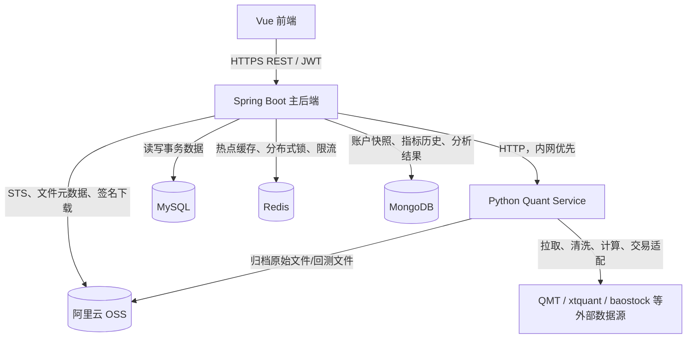
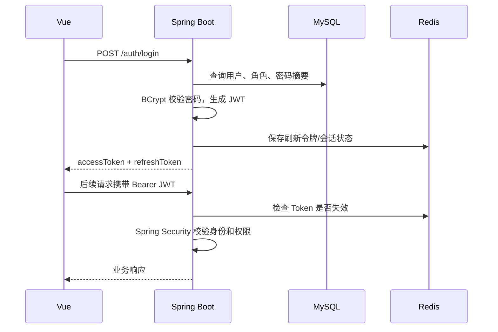
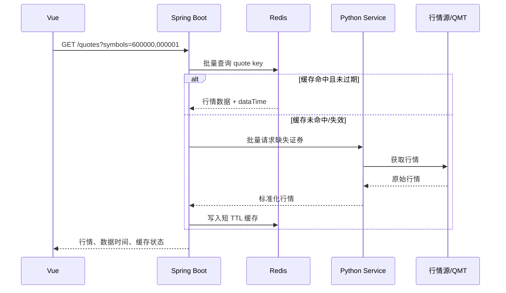
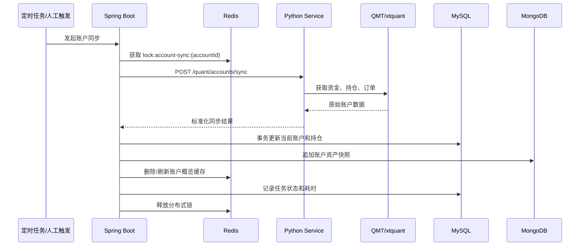

# 证券账户管理与风险分析系统：Spring Boot 迁移与实施方案

> 文档状态：规划版  
> 目标：将现有 Django + Vue 证券账户管理与风险分析项目升级为“Spring Boot 主后端 + Python 数据/量化服务 + 多存储引擎 + 阿里云 OSS”的可部署系统。  
> 本文用于指导分阶段开发、验收和简历项目包装。实施时以本文任务清单为准，并在每个阶段结束后更新进度。

---

## 1. 项目定位与改造原则

### 1.1 业务定位

系统面向个人投资者或投顾场景，提供以下能力：

- 用户登录、权限控制与账户管理。
- 证券账户、资金、持仓和历史资产快照查询。
- 实时/准实时行情查询与缓存。
- 模拟交易或对接 QMT 的委托下单、撤单和订单状态跟踪。
- 组合收益、资产配置、区域/行业维度对比分析。
- 最大回撤、波动率、VaR、最大本金亏损等风险指标计算与风险建议。
- Excel/CSV 持仓导入、风险报告导出、行情原始数据和回测结果归档。

### 1.2 改造目标

本次不是把 Django 代码逐行改写为 Java，而是保留已验证的业务场景，重新建立符合 Java 后端岗位要求的工程架构：

- Spring Boot 负责对外 REST API、认证授权、业务编排、数据持久化、缓存、任务调度和文件元数据管理。
- Python 负责数据采集、QMT/xtquant 适配、pandas/numpy 数值计算、量化指标和策略计算。
- Vue 前端尽量保留页面与交互，只切换 API 基地址、Token 处理方式和少量字段。
- 将“交易业务数据”“历史时序快照”“高频缓存”“大对象文件”存放到适合的存储中，而不是只使用一种数据库。
- 每个阶段均可独立启动与演示，避免等所有模块完成才第一次验证。

### 1.3 关键原则

1. **Spring Boot 是系统主后端。** 前端所有业务请求首先进入 Spring Boot，不直接依赖 Python 服务。
2. **Python 是能力服务，不是主业务系统。** Python 不承担用户权限、核心订单状态和主数据管理。
3. **数据库按访问模式选型。** 事务型数据使用 MySQL，短生命周期热点数据使用 Redis，大量时序/半结构化数据使用 MongoDB，文件使用 OSS。
4. **行情与风险结果必须标注数据时间。** 投资系统不能把过期缓存伪装成实时数据。
5. **真实交易与模拟交易必须隔离。** 没有明确的交易环境标识，不允许把模拟请求送到真实交易接口。
6. **任何外部调用都有超时、重试、熔断或降级。** QMT、行情源、Python 服务、OSS 都可能临时不可用。
7. **先保障正确性，再优化性能。** 但涉及订单、资金、持仓和风险指标时，正确性与可追溯性优先级最高。

---

## 2. 总体架构



### 2.1 服务边界

| 组件 | 核心职责 | 不应承担的职责 |
| --- | --- | --- |
| Vue | 页面展示、表单输入、图表渲染、使用临时凭证直传文件 | 保存永久 AK、直接调用交易接口、进行关键风控计算 |
| Spring Boot | 用户、权限、账户、订单、风险规则、API、缓存、调度、数据编排 | 直接依赖 xtquant、执行大型 pandas 计算 |
| Python Quant Service | 行情采集、账户同步、QMT 适配、复杂数值/策略计算 | 用户体系、RBAC、业务主数据最终裁决 |
| MySQL | 关系型主数据、强一致事务、业务索引 | 高频大批量时序原始行情 |
| Redis | 高并发读取、临时状态、锁、限流、幂等 | 唯一可信业务存储、永久历史数据 |
| MongoDB | 账户快照、风险计算记录、分析结果、时序文档 | 强事务订单主表、权限关系 |
| OSS | Excel/PDF/CSV/Parquet 等大文件对象 | 需要 SQL 条件查询的业务记录 |

### 2.2 推荐部署形态

开发期使用 Docker Compose，在本机同时启动 MySQL、Redis、MongoDB、Spring Boot 和 Python 服务；生产或演示环境可以部署到同一台云服务器，后续再分离。

```text
Nginx
  ├─ /              -> Vue 静态资源（OSS/CDN 或 Nginx）
  ├─ /api/*         -> Spring Boot:8080
  └─ /quant/*       -> 不对公网暴露，仅 Spring Boot 内网调用 Python:8000

Spring Boot:8080
Python Quant Service:8000
MySQL:3306（仅内网）
Redis:6379（仅内网）
MongoDB:27017（仅内网）
```

---

## 3. 推荐技术栈

### 3.1 Spring Boot 主后端

| 分类 | 推荐技术 | 使用目的 |
| --- | --- | --- |
| 运行环境 | Java 17、Spring Boot 3.x、Maven | 使用当前主流 LTS Java 与 Jakarta 生态 |
| Web | Spring Web、Spring Validation | REST API、参数校验 |
| 认证 | Spring Security、JWT | 登录、鉴权、权限控制 |
| ORM | MyBatis-Plus | CRUD、分页、条件构造、逻辑删除 |
| 事务数据库 | MySQL 8 | 用户、账户、持仓、订单、权限、文件元数据 |
| 缓存 | Redis、Redisson | 行情缓存、Token 状态、锁、限流、幂等 |
| 文档 | springdoc-openapi / Knife4j | 在线接口文档与调试 |
| 任务调度 | Spring Scheduler；后续可选 Quartz | 定时同步、风险重算、报表生成 |
| HTTP 调用 | Spring WebClient 或 OpenFeign | 调用 Python Quant Service |
| 韧性 | Resilience4j（可选） | 外部服务超时、熔断、重试、限流 |
| 测试 | JUnit 5、Mockito、MockMvc、Testcontainers（可选） | 单元、接口、集成测试 |
| 可观测性 | Actuator、Micrometer、日志 MDC | 健康检查、指标、请求追踪 |
| 部署 | Docker、Docker Compose、Nginx | 一键启动和反向代理 |

### 3.2 Python 数据与量化服务

| 分类 | 推荐技术 | 使用目的 |
| --- | --- | --- |
| Web 框架 | FastAPI、Uvicorn | 内部 HTTP 服务与 OpenAPI 文档 |
| 数据处理 | pandas、numpy | 清洗、收益率、波动率、回撤、VaR 等计算 |
| 交易/账户适配 | xtquant / QMT | 获取账户、持仓、委托、成交及交易能力 |
| 行情源 | baostock 或现有合法数据源 | 历史/基础行情数据拉取 |
| HTTP 客户端 | httpx | 调用或回调外部服务 |
| 存储 SDK | 阿里云 OSS Python SDK V2 | 原始行情、回测结果上传 OSS |
| 配置 | pydantic-settings、环境变量 | 管理外部地址、密钥、模拟/真实模式 |

### 3.3 前端与文件服务

| 分类 | 推荐技术 | 使用目的 |
| --- | --- | --- |
| 前端 | 现有 Vue 项目 | 保留业务页面与图表 |
| 请求 | Axios | 自动附加 JWT、统一错误处理、刷新 Token |
| 图表 | 沿用现有图表库 | 收益趋势、资产配置、风险指标展示 |
| 文件服务 | 阿里云 OSS、STS 或预签名 URL | 用户直传、私有文件临时下载 |

---

## 4. 数据架构与数据库职责

### 4.1 为什么不能只用一种数据库

投资系统存在四类访问模式：

1. 用户、订单、权限等数据需要事务与关联查询。
2. 最新行情和会话状态需要极低延迟、高并发读取。
3. 快照、指标、分析结果会持续增长，字段可能随算法变化。
4. Excel、PDF、CSV、Parquet 等文件体积较大，不适合放到数据库行中。

单一数据库无法同时在成本、性能、可维护性和查询能力上达到最佳效果，因此采用 MySQL + Redis + MongoDB + OSS 的组合。

### 4.2 MySQL：业务事实与强一致主数据

MySQL 是业务数据的唯一可信来源，适合需要事务、关联、唯一约束和明确状态流转的数据。

建议核心表：

| 表 | 说明 | 关键索引/约束 |
| --- | --- | --- |
| `sys_user` | 用户账号、密码摘要、状态 | `username` 唯一索引 |
| `sys_role`、`sys_permission` | 角色和权限资源 | 代码字段唯一索引 |
| `sys_user_role` | 用户角色关系 | `(user_id, role_id)` 唯一索引 |
| `account` | 证券账户基础信息 | `(user_id, account_no)` 唯一索引 |
| `position` | 当前持仓快照 | `(account_id, security_code)` 唯一索引 |
| `trade_order` | 委托订单 | `client_order_no` 唯一索引；`account_id, created_at` 联合索引 |
| `trade_execution` | 成交回报 | `(order_id, execution_no)` 唯一索引 |
| `risk_rule` | 用户或账户的风险阈值配置 | `account_id` 索引 |
| `sys_file` | OSS 文件元数据与业务关联 | `biz_type, biz_id` 联合索引；`object_key` 唯一索引 |
| `sync_task` | 同步任务、状态、耗时、错误信息 | `task_type, created_at` 联合索引 |

**何时读 MySQL：** 登录后的账户列表、当前持仓、订单列表、风险规则、用户权限、文件元数据、任务状态。  
**何时写 MySQL：** 注册、账户绑定、持仓当前状态更新、订单状态变化、规则修改、文件上传完成确认。  
**不建议写 MySQL：** 每秒级逐笔行情、完整原始行情文件、不断变化的大型指标数组。

### 4.3 Redis：热点数据与短生命周期协调状态

Redis 的定位是“让高频读取更快”和“协调并发请求”，不是永久数据库。

建议 Key 规范：

```text
quote:{market}:{symbol}                 最新行情，例如 quote:CN:600000
quote:batch:{hash}                      批量行情结果
account:summary:{accountId}             账户概览短缓存
risk:latest:{accountId}                 最近风险结果短缓存
auth:token:blacklist:{jti}              失效 JWT 标识
auth:refresh:{userId}:{deviceId}        刷新令牌或会话状态
lock:account-sync:{accountId}           账户同步分布式锁
lock:order:{clientOrderNo}              下单幂等锁
idem:order:{userId}:{requestId}         下单结果幂等缓存
rate:quote:{userId}:{minute}            行情接口限流计数
```

**何时读 Redis：** 行情接口、账户概览、最近风险报告、Token 状态、频繁访问的字典数据。  
**何时写 Redis：** Python 返回最新行情后、账户数据同步完成后、风险计算完成后、用户登出时、创建幂等键和锁时。  
**何时绕过 Redis：** 下单状态最终确认、资金/持仓最终值、历史报表查询。此类操作必须回到 MySQL 或 MongoDB。

缓存策略：

- 行情：Cache Aside。先读 Redis，未命中才调用 Python/行情源，再写入 Redis。
- 行情 TTL：交易时段建议 1 至 5 秒；非交易时段可延长为 30 至 60 秒，并在返回体明确 `dataTime` 和 `source`。
- 账户概览 TTL：10 至 60 秒，且同步成功时主动删除或刷新。
- 风险结果 TTL：根据计算成本设置为 5 至 30 分钟；风险规则修改、持仓变化后删除。
- 防击穿：热门行情使用互斥锁或逻辑过期；避免大量并发请求同时回源。
- 防穿透：不存在证券代码可短 TTL 缓存空值，或先使用布隆过滤器（后续优化项）。
- 防雪崩：TTL 加随机抖动，避免大量键同时过期。

### 4.4 MongoDB：时序快照、历史分析与可演化文档

MongoDB 适合账户资产快照、风险计算结果和分析报表等“按时间持续追加、字段可能扩展”的数据。

建议集合：

| 集合 | 典型字段 | 建议索引 |
| --- | --- | --- |
| `account_snapshots` | `accountId`、`snapshotTime`、总资产、现金、市值、收益、持仓摘要 | `{accountId: 1, snapshotTime: -1}` |
| `risk_assessments` | `accountId`、`calculatedAt`、最大回撤、波动率、VaR、评分、建议、版本 | `{accountId: 1, calculatedAt: -1}` |
| `portfolio_analyses` | `accountId`、时间范围、资产/行业/区域分布、对比指标 | `{accountId: 1, createdAt: -1}` |
| `sync_raw_result` | 任务 ID、外部返回摘要、耗时、错误信息 | `{taskId: 1}`；TTL 索引可选 |
| `market_daily_summary` | 日期、证券代码、日线指标 | `{symbol: 1, tradeDate: -1}` |

**何时读 MongoDB：** 查询资产曲线、周/月收益、风险历史、组合分析报告、同步历史。  
**何时写 MongoDB：** 定时同步账户后写快照；风险计算完成后写一条不可变评估记录；分析任务完成后保存结果。  
**何时不写 MongoDB：** 登录用户、权限、订单最终状态、库存式的当前持仓。

注意事项：

- 快照与风险结果优先采用“追加写入”，不要频繁覆盖历史文档。
- 时间统一使用 UTC 存储或明确使用 `Asia/Shanghai`，前端展示时统一转换，避免交易日跨时区错误。
- 对长期数据设置冷热策略：近 6 至 12 个月保留在线 MongoDB；更久的原始明细归档 OSS。
- 文档不要无限大。单个账户的每次快照可只存持仓摘要；完整持仓明细按需拆到独立集合或归档文件。

### 4.5 OSS：大文件与可审计对象存储

OSS 只保存文件对象，MySQL 的 `sys_file` 表保存对象与业务之间的关系。

建议对象路径：

```text
avatars/{userId}/{uuid}.png
imports/{userId}/{yyyy-MM}/{uuid}.xlsx
reports/{userId}/{yyyy-MM}/{reportId}.pdf
reports/{userId}/{yyyy-MM}/{reportId}.xlsx
market-data/{market}/{symbol}/{yyyy}/{yyyy-MM-dd}.parquet
backtests/{userId}/{strategyId}/{runId}/result.json
backtests/{userId}/{strategyId}/{runId}/equity-curve.csv
```

**何时写 OSS：** 用户上传持仓文件；生成风险报告；Python 归档原始行情、回测结果。  
**何时读 OSS：** 用户下载私有报告；异步导入任务读取 Excel；Python 回放原始行情或回测文件。  
**何时不使用 OSS：** 查询“某用户最近三笔订单”“某账户当前持仓”等业务列表。

安全要求：

- Bucket 设为私有，不公开列举和读取。
- 前端通过 STS 临时凭证或预签名 URL 直传，禁止向浏览器下发永久 AccessKey。
- Spring Boot/部署环境使用最小权限 RAM 用户或 RAM 角色。
- 下载由 Spring Boot 完成鉴权后生成短期签名 URL。
- 限制上传文件扩展名、MIME 类型、大小，并对文件名进行服务端重命名。
- 导入文件可设置 90 天生命周期；报告按用户需求保留；原始行情按成本设置低频或归档存储。
- 中国内地新建 Bucket 的访问域名规则需在部署时确认；建议绑定自定义域名并配置 HTTPS。

---

## 5. 核心数据流与调用逻辑

### 5.1 用户登录与权限校验



逻辑说明：

- 用户和权限关系只从 MySQL 获取，缓存可优化但不能替代数据库事实。
- Access Token 设置较短有效期；Refresh Token 可由 Redis 保存并支持主动注销。
- JWT 中只放用户 ID、用户名、角色等必要声明，不放账户余额、持仓等动态数据。
- 每个接口按资源权限控制，例如用户只能访问自己的 `accountId`。

### 5.2 行情查询：高频、低延迟、允许短暂最终一致



实现要求：

- 必须使用批量查询接口，禁止前端对每只股票单独请求，避免 N+1 网络调用。
- 缓存键按证券编码拆分，批量接口使用 MGET 或 pipeline 一次读取多条。
- 响应中返回 `dataTime`、`source`、`stale` 字段；超时降级时允许返回最近缓存，但必须 `stale=true`。
- Python 对不同数据源做统一字段标准化，例如证券代码、市场、最新价、涨跌幅、成交量、时间戳。
- 行情接口应按用户/IP 限流，防止图表刷新或恶意调用导致外部行情源被打满。

### 5.3 账户与持仓同步：正确性优先、异步化执行



实施细节：

- 同一个账户同一时刻只能有一个同步任务。使用 Redis 分布式锁，并设置合理过期时间与兜底释放。
- 当前持仓写 MySQL 使用唯一键 + 批量 Upsert；不要逐条先查后改。
- 整个同步结果需带有 `snapshotTime` 和来源标记，避免乱序回写覆盖较新的状态。
- MySQL 更新成功后再写 MongoDB 快照；MongoDB 失败时记录补偿任务，不回滚已确认的当前持仓。
- 账户同步不应阻塞 HTTP 请求。用户手动点击同步时创建任务并返回 `taskId`，前端轮询任务状态或使用 WebSocket/SSE（后续优化）。
- 若外部账户连接失败，保持上次成功数据，向前端返回“数据更新时间”和同步失败原因，不能清空持仓。

### 5.4 风险计算：异步任务、版本化结果、可追溯

风险计算包括最大回撤、波动率、VaR、最大本金亏损、风险评分和建议。计算依赖账户快照、持仓、价格序列和风险规则。

流程：

1. Spring Boot 接收“立即计算”请求或由定时任务触发。
2. Spring Boot 从 MySQL 获取当前持仓与风险规则，从 MongoDB 获取指定时间段资产快照。
3. 先检查 Redis 是否有相同账户、相同数据版本、相同规则版本的计算结果。
4. 缓存未命中时，Spring Boot 组装标准计算请求，调用 Python `/quant/risk/calculate`。
5. Python 使用 pandas/numpy 计算指标，返回指标值、样本时间范围、算法版本、异常说明。
6. Spring Boot 校验结果合理性后，在 MongoDB 追加保存 `risk_assessments`，并更新 Redis 最近结果。
7. Spring Boot 按规则将风险等级和建议返回前端。

重要约束：

- 计算请求必须包含 `dataVersion` 或最后快照时间、`ruleVersion`、`algorithmVersion`，保证结果可复现。
- 风险指标需说明数据窗口，例如“过去 250 个交易日”“95% 置信水平 VaR”。不能只展示一个无来源数字。
- 前端显示“计算时间”“覆盖数据范围”“是否使用过期行情”。
- 指标异常、数据缺失、样本量不足必须有明确状态，不能返回看似正常的零值。

### 5.5 下单与撤单：强一致、幂等与审计

真实交易风险最高。开发初期先实现模拟交易，真实 QMT 交易采用开关控制并严格隔离。

下单流程：

1. Vue 生成并提交 `requestId`，携带账户、证券、方向、数量、价格和交易环境。
2. Spring Boot 校验 JWT、账户归属、参数精度、交易时段、风险限制。
3. Spring Boot 尝试写入 Redis 幂等键 `idem:order:{userId}:{requestId}`。
4. 如果键已存在，直接返回首次请求的订单结果，不重复向 Python/QMT 发单。
5. Spring Boot 在 MySQL 事务中创建 `PENDING_SUBMIT` 订单和审计记录。
6. 调用 Python 交易适配接口；Python 再调用 QMT 或模拟撮合模块。
7. Spring Boot 将订单更新为 `SUBMITTED`、`REJECTED` 或 `UNKNOWN`；任何外部超时不得直接认定下单失败。
8. 后续通过轮询或回报同步更新订单最终状态与成交记录。

订单注意事项：

- `client_order_no` 必须全局唯一，并在 MySQL 建唯一索引。
- HTTP 调用超时可能发生“券商已受理但客户端未收到响应”，此时状态应为 `UNKNOWN`，随后通过订单查询确认，不可盲目重试。
- 订单、成交和资金变动必须记录审计日志：操作人、时间、参数、外部请求 ID、外部响应摘要。
- 建议开发环境只启用 `SIMULATION`，生产真实交易必须单独配置 `REAL`，并在接口和页面明显展示。

### 5.6 OSS 文件流程：直传、确认、异步处理

1. Vue 请求 Spring Boot 获取上传策略：文件类型、业务类型、大小、文件名。
2. Spring Boot 校验用户权限后生成对象键，返回 STS 临时凭证或预签名 URL。
3. Vue 直接上传 OSS，避免大文件经过 Spring Boot 占满应用带宽。
4. Vue 调用“上传完成确认”接口，Spring Boot 校验对象存在性并写入 `sys_file`。
5. 若是持仓导入文件，创建异步解析任务；解析成功后批量写 MySQL，失败则保存错误行信息。
6. 下载私有文件时，Spring Boot 先校验文件所属用户/业务权限，再返回短期签名下载 URL。

---

## 6. 接口设计与服务契约

### 6.1 Spring Boot 对 Vue 的核心接口

| 模块 | 接口示例 | 说明 |
| --- | --- | --- |
| 认证 | `POST /api/auth/login`、`POST /api/auth/refresh`、`POST /api/auth/logout` | JWT 登录与会话管理 |
| 账户 | `GET /api/accounts`、`GET /api/accounts/{id}`、`POST /api/accounts/{id}/sync` | 账户查询与异步同步 |
| 持仓 | `GET /api/accounts/{id}/positions` | 当前持仓与估值 |
| 资产历史 | `GET /api/accounts/{id}/snapshots?from=&to=&granularity=` | 从 MongoDB 聚合历史曲线 |
| 行情 | `GET /api/quotes?symbols=...` | 先 Redis，后 Python 服务 |
| 订单 | `POST /api/orders`、`POST /api/orders/{id}/cancel`、`GET /api/orders` | 幂等、状态流转、审计 |
| 风险 | `POST /api/accounts/{id}/risk-assessments`、`GET /api/accounts/{id}/risk-assessments/latest` | 异步计算与历史查询 |
| 分析 | `GET /api/accounts/{id}/analyses/allocation` | 资产、区域、行业、周期对比 |
| 文件 | `POST /api/files/upload-policy`、`POST /api/files/complete`、`GET /api/files/{id}/download-url` | OSS 文件中心 |
| 任务 | `GET /api/tasks/{taskId}` | 同步、导入、报告生成等长任务状态 |

统一响应建议：

```json
{
  "code": 0,
  "message": "success",
  "data": {},
  "traceId": "...",
  "timestamp": "2026-08-05T10:00:00+08:00"
}
```

行情和风险接口应增加业务元信息：

```json
{
  "code": 0,
  "data": {
    "value": {},
    "dataTime": "2026-08-05T10:00:00+08:00",
    "source": "redis",
    "stale": false,
    "algorithmVersion": "risk-v1"
  }
}
```

### 6.2 Spring Boot 与 Python 的内部接口

Python 服务仅允许 Spring Boot 调用，建议部署在内网，并携带内部服务 Token 或 mTLS（后续增强）。

| Python 接口 | Spring Boot 调用时机 | 返回重点 |
| --- | --- | --- |
| `POST /quant/accounts/sync` | 定时或用户触发账户同步 | 资金、持仓、同步时间、来源、错误码 |
| `GET /quant/quotes` | Redis 未命中时批量拉行情 | 标准化行情、行情时间、市场状态 |
| `POST /quant/risk/calculate` | 需要计算或缓存失效时 | 指标、样本范围、算法版本、异常信息 |
| `POST /quant/orders/submit` | MySQL 创建待提交订单后 | 外部订单号、受理状态、错误信息 |
| `POST /quant/orders/cancel` | 订单可撤状态下 | 撤单受理状态、外部请求号 |
| `POST /quant/backtests/run` | 后续策略回测功能 | `taskId`、结果文件路径、指标摘要 |

内部请求必须包含：

- `traceId`：贯穿 Vue、Spring Boot、Python、外部系统日志。
- `requestId`：支持幂等，尤其用于下单。
- `environment`：`SIMULATION` 或 `REAL`。
- `timeout`：不同接口区别配置，行情短、风险中等、回测长任务异步。
- `schemaVersion`：防止两端字段升级时静默出错。

---

## 7. 性能设计：投资场景重点

### 7.1 性能目标建议

以下为毕业设计/简历演示版本的合理目标，实际目标需依据服务器与数据源能力压测确认。

| 场景 | 目标 | 设计方式 |
| --- | --- | --- |
| 登录、账户列表 | P95 小于 300ms | MySQL 索引、Redis 会话、分页 |
| 已缓存行情 | P95 小于 100ms | Redis MGET/pipeline、批量接口 |
| 缓存未命中行情 | P95 小于 1s | Python 批量请求、短超时、回退最近缓存 |
| 当前持仓查询 | P95 小于 300ms | MySQL 联合索引、避免逐行查行情 |
| 账户同步 | 10 至 60 秒可接受 | 异步任务、锁、批量 Upsert |
| 风险计算 | 5 至 30 秒可接受 | 异步任务、缓存、Python 计算 |
| 大文件上传 | 不占用应用带宽 | Vue 直传 OSS、分片上传 |
| 下单受理 | 主流程尽量小于 2 秒 | 事务短小、幂等、外部调用超时控制 |

### 7.2 查询性能

- 任何列表接口必须分页，禁止一次返回全量订单、快照或行情历史。
- 避免 N+1 查询：查询账户下多只持仓时，应批量获取证券信息和行情，不能循环调用数据库/API。
- MySQL 只对高频条件创建索引。常见组合为 `account_id + created_at`、`account_id + security_code`、`user_id + status`。
- 使用 `EXPLAIN` 检查慢 SQL；避免索引列上使用函数、隐式类型转换和前置模糊查询。
- MongoDB 历史曲线按 `accountId + snapshotTime` 查询，并根据前端粒度进行服务端降采样；不能把每分钟原始点全部返回给图表。
- 图表数据在服务端做按天/周/月聚合，前端只展示必要数量的点。

### 7.3 缓存性能与一致性

- 对行情采用“短 TTL + 数据时间戳”而不是无限缓存。
- 不要使用 Redis 缓存最终订单状态或资金余额作为唯一数据来源；它只能加速读取。
- 账户同步、订单状态变更、风险规则修改后，主动删除关联缓存，而非等待 TTL。
- 大批量缓存写入使用 pipeline；批量读取使用 MGET。
- Redis 分布式锁只用于防止并发重复执行，锁的过期时间必须大于正常任务执行时间，并保证异常情况下可恢复。
- 重要锁建议使用 Redisson，避免仅用简单 `SETNX` 时因续期和误删产生问题。

### 7.4 外部数据源与 Python 服务性能

- 前端的自动刷新频率要受控，默认 3 至 5 秒一次或用户主动刷新；禁止每个组件各自轮询。
- Spring Boot 将同一时间窗口内的相同行情请求合并或命中缓存，避免“缓存击穿后同时回源”。
- Python 接口以批量证券代码入参为主，不设计单只股票高频循环接口。
- 调用 Python 设置连接超时和读取超时，并区分错误类型：网络超时、外部源限流、账户未登录、数据为空。
- 对不可恢复错误不要立即无限重试；行情可有限重试一次，账户同步可延迟重试，订单必须查询状态后再决定补偿。
- 对 CPU 密集型风险计算设置任务队列或线程/进程池，不能让 Uvicorn Web Worker 被单个大计算长期占用。

### 7.5 写入性能

- 持仓同步采用批量 Upsert，单次事务尽量只涵盖 MySQL 当前状态更新与任务状态修改。
- MongoDB 快照使用批量插入或按账户串行写入，避免多个同步任务重复写同一时间点。
- 历史行情不逐条写库；优先批量处理并以 Parquet/CSV 文件归档 OSS，必要的日级指标再写 MongoDB。
- 导入 Excel 使用异步任务和分批提交，例如每 500 至 1000 行一批，避免长事务和内存膨胀。

### 7.6 监控与压测

必须记录以下指标：

- API QPS、P50/P95/P99 响应时间、错误率。
- Redis 命中率、内存使用、慢命令。
- MySQL 慢查询、连接池使用率、索引命中情况。
- MongoDB 查询耗时、文档增长量、索引大小。
- Python 服务耗时、外部数据源耗时、超时次数。
- 账户同步成功率、行情新鲜度、风险计算队列长度、订单状态未知数量。

测试工具可选 JMeter、k6 或 Gatling。至少覆盖：登录并发、批量行情、账户列表、风险报告查询、文件上传策略接口。

---

## 8. 一致性、可靠性与异常处理

### 8.1 一致性级别

| 数据/功能 | 一致性要求 | 方案 |
| --- | --- | --- |
| 用户、权限、订单状态 | 强一致 | MySQL 事务、唯一约束、乐观锁/状态机 |
| 当前持仓和资金 | 高一致 | 同步锁、数据时间戳、MySQL 事务、后续对账 |
| 行情 | 最终一致 | Redis 短 TTL、返回时间戳、可回退最近值 |
| 账户历史快照 | 最终一致且可补偿 | MySQL 成功后写 MongoDB，失败重试补写 |
| 风险报告 | 版本一致 | 关联数据版本、规则版本、算法版本 |
| OSS 文件元数据 | 最终一致 | 上传完成后确认对象存在，再写 MySQL；孤儿文件定期清理 |

### 8.2 状态机建议

订单状态：

```text
PENDING_SUBMIT -> SUBMITTED -> PARTIALLY_FILLED -> FILLED
                     |              |
                     v              v
                  REJECTED      CANCEL_PENDING -> CANCELED

外部超时：PENDING_SUBMIT -> UNKNOWN -> 通过查询确认最终状态
```

同步任务状态：

```text
PENDING -> RUNNING -> SUCCESS
                   -> FAILED
                   -> PARTIAL_SUCCESS
                   -> RETRYING
```

### 8.3 常见异常与处理

| 异常 | 处理策略 |
| --- | --- |
| Redis 不可用 | 行情可短暂回源；登录/订单关键路径按配置降级并告警；不得静默丢失幂等保障 |
| MySQL 写入失败 | 回滚事务，返回明确错误；不写“成功”响应 |
| MongoDB 快照写失败 | MySQL 当前状态仍保留，记录补偿任务异步重试 |
| Python 服务超时 | 行情返回最近缓存并标记过期；风险任务置失败可重试；订单置 `UNKNOWN` 后查询确认 |
| QMT/行情源断连 | 标记数据源不可用，保留最近成功数据与时间；避免清空历史数据 |
| OSS 上传成功但元数据写失败 | 定时扫描孤儿对象或重试完成确认 |
| 文件元数据存在但 OSS 对象不存在 | 下载前校验，标记文件异常并告警 |
| 同一账户重复同步 | Redis 锁拒绝重复任务，返回已有任务 ID |

---

## 9. 安全与合规注意事项

- 密码只存 BCrypt 哈希，禁止明文或可逆加密。
- 永久 AccessKey、数据库密码、JWT 密钥、QMT 凭据全部通过环境变量或密钥管理服务注入，不能提交 Git。
- 配置文件只保留 `.env.example`、`application-dev.example.yml` 模板。
- 所有接口使用 HTTPS；生产环境关闭 Swagger 的未授权访问。
- JWT 密钥要有长度和轮换策略；刷新 Token 可以按设备管理。
- 核心操作记录审计日志：登录、账户绑定、同步、下单、撤单、文件下载、风险规则修改。
- 不在日志输出密码、Token、完整身份证明、账户敏感字段、AccessKey 或完整外部响应。
- 上传文件先校验扩展名、MIME、大小和业务权限；解析 Excel 时防范公式注入与压缩炸弹。
- 真实交易开关需要后端强制校验，不能仅靠前端隐藏按钮。
- 投资分析结果需要标注“仅用于教学/模拟分析，不构成投资建议”，避免误导性表述。

---

## 10. 分阶段实施计划与验收标准

### 阶段 0：现状盘点与契约冻结

任务：

- 列出 Django 路由、视图、MongoDB 集合、Vue API 调用。
- 为每个旧接口标注：保留、重写、移到 Python、废弃、模拟实现。
- 设计 MySQL DDL、MongoDB 集合和 Redis Key 规范。
- 定义 Java-Python JSON 协议和错误码。
- 确定开发数据：模拟账户、模拟行情、测试用户。

验收：有《接口迁移清单》《数据模型设计》《Python 服务契约》三个文档，且能据此开始建工程。

### 阶段 1：Spring Boot 工程与基础设施

任务：

- 创建 `springboot-backend` Maven 工程和分层包结构。
- 接入 MySQL、Redis、MongoDB，提供健康检查。
- 实现统一响应、全局异常、参数校验、日志 `traceId`、OpenAPI 文档。
- 创建 Docker Compose，运行所有基础中间件。
- 新建初始化 SQL 和开发配置模板。

验收：一条命令能启动依赖服务，Spring Boot 可连接三种数据库，接口文档可访问。

### 阶段 2：认证、用户与权限

任务：

- 创建用户、角色、权限数据表。
- 实现注册、登录、刷新 Token、退出登录。
- 配置 Spring Security、JWT Filter、RBAC 注解或权限拦截。
- 使用 Redis 保存会话/黑名单和刷新 Token。
- 完成登录与权限相关测试。

验收：普通用户无法访问管理员接口；退出后 Token 失效；密码不会以明文出现。

### 阶段 3：账户、持仓与资产快照最小闭环

任务：

- 创建账户、当前持仓、同步任务表。
- 实现账户列表、账户详情、持仓分页查询。
- 先实现模拟同步器，写入 MySQL 当前状态和 MongoDB 快照。
- 实现账户资产历史曲线接口和 Redis 账户概览缓存。
- Vue 切换登录、账户、持仓、趋势图 API。

验收：用户登录后可查看模拟账户、持仓、资产趋势；触发同步后数据和快照变化可见。

### 阶段 4：Python Quant Service 拆分

任务：

- 创建 `python-quant-service` FastAPI 工程。
- 从 Django 提取 `xtquant`、`baostock`、`pandas/numpy` 相关逻辑。
- 先实现模拟模式，再实现真实 QMT 适配开关。
- 实现账户同步、批量行情、风险计算接口。
- Spring Boot 使用 WebClient/OpenFeign 调用，增加超时、重试和降级。

验收：在不依赖 Django 的情况下，Spring Boot 可以调用 Python 获取模拟或真实数据。

### 阶段 5：行情、订单、风险和组合分析

任务：

- 实现 Redis 行情缓存、批量查询、过期标记和限流。
- 实现模拟订单状态机、幂等键、订单审计和撤单逻辑。
- 接入真实交易前完成 `SIMULATION/REAL` 环境隔离。
- 实现风险规则、异步风险计算、指标版本化与报告查询。
- 实现资产配置、区域/行业、年度/周度对比分析。
- 定时同步账户、定时刷新风险结果。

验收：可演示“行情 -> 下单 -> 订单查询 -> 撤单”和“账户 -> 风险计算 -> 历史报告”的完整链路。

### 阶段 6：OSS 文件中心

任务：

- 配置私有 Bucket、RAM 最小权限、环境变量。
- 创建 `sys_file` 表和文件服务接口。
- 实现 STS/预签名上传、上传完成确认、私有下载签名。
- 实现持仓 Excel 导入及异步解析。
- 实现风险报告 PDF/Excel 导出上传。
- Python 归档行情原始文件和回测结果。
- 配置对象生命周期、孤儿文件清理任务。

验收：用户可安全上传和下载自己的文件；导入、报告和归档都能在 OSS 中追溯。

### 阶段 7：测试、性能、部署和项目材料

任务：

- 补充单元测试、接口测试、关键集成测试。
- 使用 k6/JMeter 完成基本压测并记录结果。
- 优化慢 SQL、缓存命中率、批量处理和任务并发度。
- 完善 Docker Compose、Nginx、环境变量模板和部署 README。
- 制作架构图、接口图、数据库图、演示数据和截图。
- 整理简历描述、STAR 项目经历和高频面试问题。

验收：新环境可按 README 启动；核心流程有测试和演示；项目材料可直接用于简历和答辩。

---

## 11. 项目目录建议

```text
毕业设计/
├─ StockVueVision/                  # 保留并逐步切换 API 的 Vue 前端
├─ StockManager_Backendcode/        # 原 Django 项目，仅作迁移参考
├─ springboot-backend/
│  ├─ src/main/java/com/.../stockmanager/
│  │  ├─ common/                    # 统一响应、异常、工具、枚举
│  │  ├─ config/                    # Security、Redis、Mongo、Web 配置
│  │  ├─ system/                    # 用户、认证、角色、权限
│  │  ├─ account/                   # 账户、持仓、资产快照
│  │  ├─ trade/                     # 行情、订单、成交、模拟交易
│  │  ├─ risk/                      # 风险规则、评估、报告
│  │  ├─ analysis/                  # 资产、行业、区域、周期分析
│  │  ├─ file/                      # OSS 文件服务、导入导出
│  │  ├─ integration/               # Python 服务、外部系统客户端
│  │  └─ job/                       # 定时任务、补偿任务
│  ├─ src/main/resources/
│  │  ├─ mapper/
│  │  ├─ db/migration/
│  │  └─ application-*.yml
│  └─ Dockerfile
├─ python-quant-service/
│  ├─ app/
│  │  ├─ api/
│  │  ├─ services/
│  │  ├─ adapters/                  # QMT、行情源适配器
│  │  ├─ calculations/              # pandas/numpy 指标计算
│  │  └─ schemas/
│  └─ Dockerfile
├─ deploy/
│  ├─ docker-compose.yml
│  ├─ nginx/
│  └─ env.example
└─ docs/
   ├─ SpringBoot迁移与实施方案.md
   ├─ 接口迁移清单.md
   ├─ 数据模型设计.md
   ├─ Python服务契约.md
   └─ progress.md
```

---

## 12. 优缺点与取舍

### 12.1 采用 Spring Boot + Python 双服务的优点

- Spring Boot 展示 Java 后端核心能力：安全、事务、缓存、数据库、调度、工程化。
- 保留 Python 在量化数据处理和 QMT SDK 适配方面的优势。
- Python 不稳定或不具备交易环境时，Spring Boot 其他业务仍能使用模拟数据运行。
- 后续可以独立扩展 Python 计算实例，不影响用户、订单和权限服务。
- 对简历和面试而言，架构拆分、存储选型、缓存策略、幂等与可靠性都有明确可讲点。

### 12.2 代价与应对方式

| 代价 | 风险 | 应对 |
| --- | --- | --- |
| 多一个 Python 服务 | 本地启动和部署复杂度增加 | Docker Compose、一键启动、接口契约文档 |
| HTTP 调用增加延迟 | 行情和下单体验受影响 | 批量接口、Redis 缓存、内网调用、超时控制 |
| 多数据库一致性复杂 | 快照或文件元数据可能不一致 | 明确主数据、异步补偿、任务状态、对账任务 |
| QMT 依赖本地环境 | 演示时可能不可用 | 设计 `SIMULATION` 模式，真实模式可配置 |
| OSS 产生存储和流量费用 | 原始数据长期增长 | 生命周期策略、Parquet 压缩、按需归档 |

---

## 13. 当前开工顺序

第一轮只做阶段 0 和阶段 1，不直接开始交易、OSS 或复杂风控。

具体执行任务：

1. 阅读现有 Django 路由、视图、MongoDB 使用点和 Vue API 文件。
2. 创建 `docs/接口迁移清单.md`，列出每个旧接口的迁移归属和优先级。
3. 创建 `docs/数据模型设计.md`，确定 MySQL、MongoDB、Redis、OSS 的字段与边界。
4. 在根目录建立 `springboot-backend` 初始工程。
5. 建立 MySQL/Redis/MongoDB 的 Docker Compose 配置与本地启动说明。
6. 完成健康检查、统一响应、异常处理、接口文档，并验证三类存储连接。

完成这一轮后，系统应具备一个可启动的 Spring Boot 骨架，后续每个会话只推进一个明确的阶段并将进度记录到 `docs/progress.md`。

---

## 14. 前端迁移与实施计划

### 14.1 前端改造结论

现有 `StockVueVision` 是独立的 Vue 3 + Vite 单页应用，不依赖 Django 模板渲染，因此页面、图表、Element Plus 组件和大部分业务交互可以直接保留。迁移重点是请求适配层、认证状态、路由权限、长任务交互和 OSS 文件上传，不需要重新开发整套前端。

目标是把前端改造成稳定的“接口消费者”：

- Vue 只访问 Spring Boot 暴露的 `/api/v1/**`。
- Vue 不直接调用 Python Quant Service，也不直接连接 MySQL、MongoDB 或 Redis。
- 所有请求统一经过一个 Axios 实例，统一处理 Token、错误码、超时、取消请求和 `traceId`。
- 页面组件不直接解析多种后端返回格式，统一由 `src/api` 和 `src/adapters` 转换。
- 行情、同步任务、风险任务等不同实时性的数据采用不同刷新策略。
- OSS 大文件由浏览器使用临时凭证或预签名地址直传，永久密钥绝不进入前端。

### 14.2 现有前端保留与改造范围

| 前端部分 | 处理方式 | 说明 |
| --- | --- | --- |
| Vue 页面与布局 | 主要保留 | 登录、账户展示、对比分析、交易页面继续使用 |
| Element Plus 组件 | 保留 | 不更换 UI 框架 |
| ECharts 图表 | 保留并优化 | 后端输出降采样后的标准图表数据 |
| Pinia | 保留并扩展 | 增加认证、行情、任务、文件等 Store |
| Vue Router | 保留并增加守卫 | 路由增加 `requiresAuth`、角色和交易环境元数据 |
| `src/api` | 重点重构 | 删除多个 Axios 实例和硬编码地址，按业务模块拆分 |
| `httpClient.js` | 重构 | 统一 Token、刷新、错误、取消、超时和请求追踪 |
| 数据转换器 | 保留并集中管理 | 将 Java DTO 转成图表/页面模型，避免页面耦合后端字段 |
| Mock 数据 | 保留 | 作为无 QMT 环境和前端独立开发的降级数据 |
| 明文记忆密码 | 删除 | 只能记住用户名，禁止在 LocalStorage 保存密码 |
| Excel 导入导出 | 改造 | 上传改为 OSS 直传；服务端生成正式报告 |

### 14.3 推荐前端目录

```text
StockVueVision/src/
├─ api/
│  ├─ authApi.js
│  ├─ accountApi.js
│  ├─ marketApi.js
│  ├─ orderApi.js
│  ├─ riskApi.js
│  ├─ analysisApi.js
│  ├─ fileApi.js
│  └─ taskApi.js
├─ adapters/
│  ├─ accountAdapter.js
│  ├─ quoteAdapter.js
│  ├─ riskAdapter.js
│  └─ analysisAdapter.js
├─ stores/
│  ├─ auth.js
│  ├─ account.js
│  ├─ market.js
│  └─ task.js
├─ utils/
│  ├─ httpClient.js
│  ├─ requestCancel.js
│  ├─ dateTime.js
│  └─ money.js
├─ router/
│  └─ index.js
└─ views/
```

### 14.4 统一 HTTP 客户端任务

1. 使用 `VITE_API_BASE_URL` 管理开发、测试和生产环境，不再写死 `http://localhost:8000`。
2. 开发环境推荐配置 Vite Proxy，把 `/api` 转发到 Spring Boot `http://localhost:8080`，减少跨域差异。
3. 请求拦截器自动加入 `Authorization: Bearer <accessToken>`、`X-Request-Id` 和 `X-Client-Version`。
4. 响应拦截器统一解包 `{code, message, data, traceId, timestamp}`。
5. 收到业务错误码时展示用户可读提示；保留 `traceId` 方便后端排查。
6. `401` 时只允许发起一次刷新 Token 请求，其他失败请求排队等待；刷新成功后重放，失败后清除认证状态并跳转登录页。
7. 页面离开或查询条件变化时取消过期请求，避免旧响应覆盖新筛选结果。
8. GET 行情可进行有限重试；POST 下单、撤单禁止由 Axios 自动重试，必须依靠业务幂等和状态查询。

### 14.5 前端状态设计

| Store | 保存内容 | 持久化策略 |
| --- | --- | --- |
| `authStore` | 用户摘要、角色、登录状态、Token 过期时间 | Refresh Token 优先 HttpOnly Cookie；不得保存密码 |
| `accountStore` | 账户列表、当前账户 ID、账户概览 | 当前账户 ID 可本地保存；资产数据以服务端为准 |
| `marketStore` | 订阅证券、最近行情、行情时间 | 内存保存，刷新页面后重新获取 |
| `taskStore` | 同步、风险、导入、报告任务状态 | 内存为主，页面恢复时按 taskId 再查询 |
| `preferenceStore` | 图表周期、主题、表格列偏好 | 可使用 LocalStorage |

### 14.6 页面级改造任务

#### 登录页

- 适配 Spring Boot 登录响应和 JWT。
- 删除 LocalStorage 明文密码；“记住我”只延长会话或记住用户名。
- 展示账号禁用、密码错误、服务不可用等明确提示。
- 登录成功后根据原目标路由跳转，而不是始终进入固定页面。

#### 账户与持仓页

- 首次进入获取账户列表并选择默认账户。
- 账户概览、持仓和历史曲线分别加载，避免一个慢接口阻塞整页。
- 同步操作返回 `taskId` 后展示任务进度，禁止长时间卡住按钮等待 HTTP 完成。
- 所有资金值使用统一金额格式；证券数量、成本、现价、收益率保持精度和空值语义。
- 展示数据来源、最后更新时间和是否过期。

#### 行情与交易页

- 一次批量请求页面当前可见证券，禁止每行单独请求。
- 自动刷新设置全页唯一计时器，页面不可见时暂停或降低刷新频率。
- 交易按钮具有防重复提交状态；提交请求必须带 `X-Idempotency-Key`。
- 下单超时显示“状态确认中”，不能直接显示“失败”并诱导用户重复下单。
- 显著展示 `SIMULATION`/`REAL` 环境，真实环境操作增加确认步骤。

#### 风险与组合分析页

- 快速查询最近一次结果；需要重算时创建异步任务。
- 展示数据窗口、样本数量、算法版本、计算时间和行情新鲜度。
- 指标不可用时显示原因，不把缺失值绘制为 0。
- 曲线点数由后端按日/周/月聚合，前端避免处理超大原始数组。

#### 文件与报告页面

- 上传前校验扩展名、MIME、大小，显示上传进度。
- 获取上传策略后直传 OSS，再调用完成确认接口。
- Excel 导入采用异步任务，展示总行数、成功行数、失败行数和错误报告下载。
- 私有报告下载前向 Spring Boot 请求短期签名 URL。

### 14.7 前端性能要求

- 首屏只加载当前页面必要接口，不在根组件预加载全部账户历史和分析数据。
- 路由级页面采用动态导入；体积较大的 Excel/图表功能按需加载。
- 所有长列表分页或虚拟滚动；持仓、订单默认每页 20 至 50 条。
- 搜索输入使用 300 至 500ms 防抖；条件切换取消旧请求。
- 批量行情建议 3 至 5 秒刷新一次，后台标签页降频；真实频率最终受数据源授权与限流约束。
- 图表最多返回页面真正可辨识的点数，例如 300 至 1000 点；更多原始数据通过导出文件获取。
- 不在 Pinia/LocalStorage 长期保存完整行情历史和大型分析结果。
- 生产构建关闭详细 API 日志，避免大量行情响应输出到控制台造成性能与敏感数据问题。

### 14.8 前端测试与验收

- API 单元测试：响应解包、Token 刷新、错误码映射、数据适配器。
- 组件测试：空数据、加载中、过期数据、指标不可用、权限不足。
- E2E：登录、查看账户、同步任务、风险计算、模拟下单、撤单、文件上传和下载。
- 弱网测试：行情超时、Python 服务不可用、重复下单、Token 过期。
- 桌面和移动端至少验证主要页面不溢出；交易表格移动端可采用卡片或横向滚动。

---

## 15. 前后端协同迁移策略

### 15.1 接口先行

所有新功能在开发前先更新《证券账户管理系统接口文档》，明确路径、字段、错误码、数据来源和性能要求。Spring Boot DTO、Python Pydantic Schema 和 Vue Type/Adapter 均以接口文档为契约。

### 15.2 分模块切换

迁移期间不要求一次切换全部模块，使用以下顺序：

1. 认证模块切换到 Spring Boot。
2. 账户与当前持仓切换到 Spring Boot 模拟数据。
3. 历史快照与风险结果切换到 Spring Boot + MongoDB。
4. Spring Boot 接入 Python 后切换真实账户与行情。
5. 订单、组合分析和 OSS 文件模块切换。
6. 所有 Vue API 已切换并通过测试后，Django 退出运行链路，只保留参考代码。

### 15.3 兼容策略

- 新接口统一使用 `/api/v1` 前缀，不继续扩展旧 Django 路径。
- Vue 的 API 函数可以暂时保留原函数名，内部切换到新路径，从而减少页面组件改动。
- 字段由前端 Adapter 临时兼容 `snake_case` 和 `camelCase`；最终公开接口统一采用 `camelCase`。
- 不建议 Spring Boot 永久复制所有旧响应格式，否则新后端会长期背负旧接口设计问题。

### 15.4 联调完成定义

一个接口只有同时满足以下条件才算完成：

- 接口文档已更新并有成功、失败示例。
- Spring Boot/Python 实现与文档一致。
- Vue 已使用统一 HTTP 客户端调用。
- 正常、空数据、无权限、超时和服务异常均有明确表现。
- 至少有一项自动化测试覆盖核心路径。
- 日志中可用同一个 `traceId` 关联前端请求、Java 调用和 Python 调用。

---

## 16. 前后端联合里程碑

| 里程碑 | Spring Boot | Python | Vue | 可演示结果 |
| --- | --- | --- | --- | --- |
| M1 工程闭环 | 基础工程、统一响应、数据库连接 | 健康检查骨架 | 统一 Axios、环境配置 | Vue 能调用 Java 健康接口 |
| M2 登录闭环 | JWT、RBAC、用户接口 | 无 | 登录页、路由守卫、Token 刷新 | 登录后进入受保护页面 |
| M3 账户闭环 | 账户、持仓、快照、任务 | 模拟账户接口 | 账户页、持仓页、趋势图 | 模拟账户完整展示与同步 |
| M4 数据闭环 | Python 客户端、缓存、降级 | QMT/行情适配、批量行情 | 行情刷新、数据时间提示 | 可切换模拟/真实数据 |
| M5 投资闭环 | 订单状态机、风险、分析 | 交易适配、风险计算 | 交易、风险、对比页面 | 模拟下单与风险报告 |
| M6 文件闭环 | 文件元数据、STS、异步任务 | 行情/回测归档 | 导入、导出、进度 | OSS 文件全流程 |
| M7 交付闭环 | 测试、监控、Docker | 测试、Docker | E2E、生产构建 | 一键部署与答辩演示 |

---

## 17. 配套接口文档

完整接口定义单独维护在根目录的《证券账户管理系统接口文档.md》中，采用“模块 → 接口 → 基本信息 → 请求参数 → 响应字段 → 示例 → 数据与性能说明”的结构。后续实际实现若调整路径或字段，必须同步修改该文档，禁止代码与文档长期不一致。
